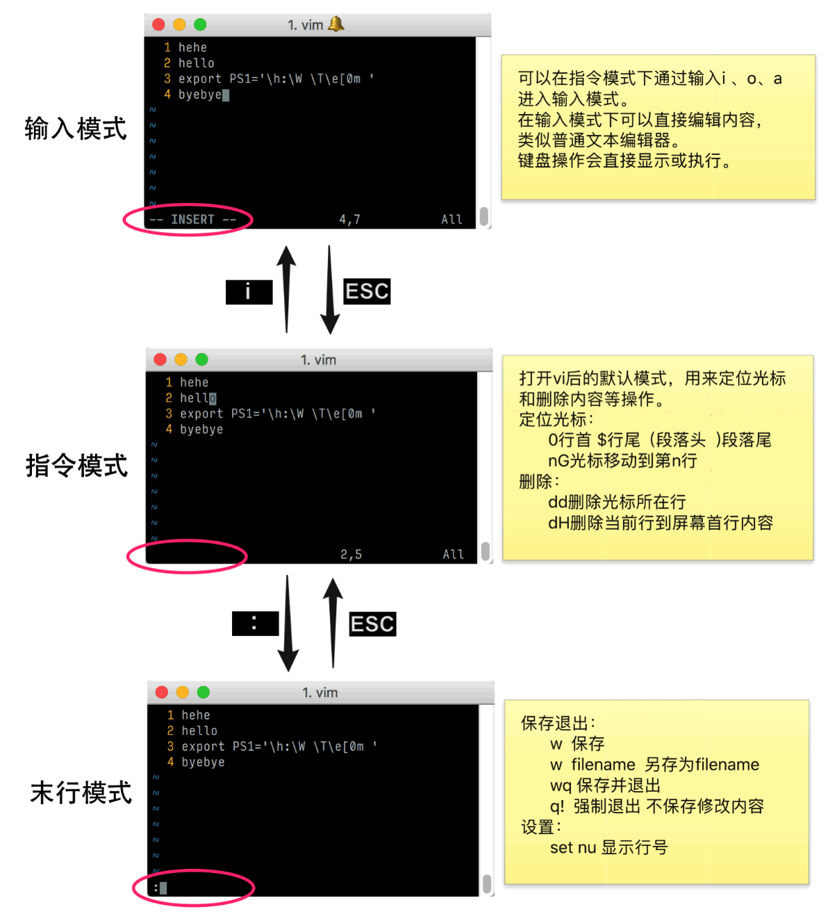

# 颜色区分不同文件类型

视频介绍:[点我到优酷看视频](http://www.youku.com)

## alias别名设置
`ls`命令的作用是显示当前目录下的文件，当我们给`ls`命令添加参数`-G`则代表列出的文件按照类型用不同颜色区分显示。
因此，我们可以通过`alias`别名设置，将`-G`参数默认绑定到`ls`命令上,即执行命令：

```bash
ls='ls -G'    #意思是 用户输入 ls 等价于输入 ls -G
```
但是，这条命令只是临时生效，我们需要将命令写入用户配置文件`~/.bash_profile` 才可以默认登录生效。
其他一些常用写入配置文件的别名:
```bash
ll='ls -l'    #用ll命令代替 ls -l 命令
grep='grep --color=auto'   #这样在执行grep字符串搜索命令时，匹配内容会自动标记颜色
```
> 我们还可以通过 ls -F 区分文件和目录 


## vi的基本使用
`vi`是最常用的命令行界面文本编辑器，其功能强大，但一般用户只需要掌握基础使用方法即可。<br>
下图总结了`vi`的**三种模式**，模式切换和不同模式下的主要功能，可以配合视频介绍了解vi使用。<br>
**请注意图片中不同模式在窗口右下角的显示内容**




